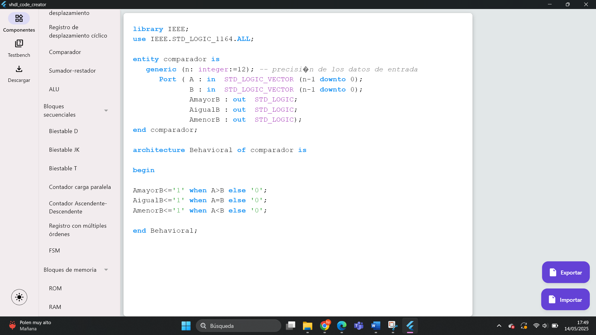
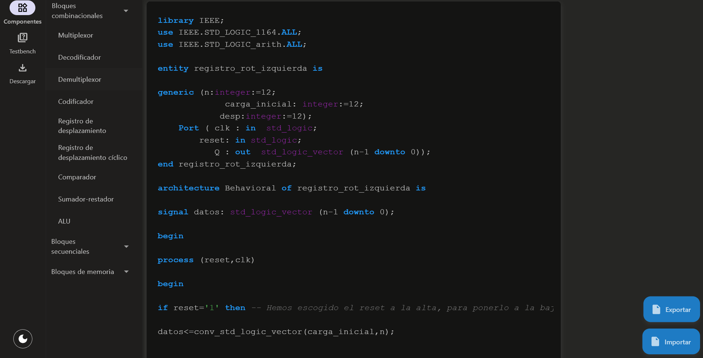
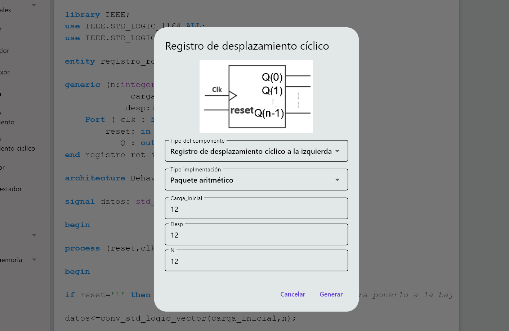

# CAD Tool for Automatic VHDL Code Generation

A modern, educational CAD tool to generate VHDL components and testbenches automatically.

## Project Overview

This project is a desktop CAD application designed to automatically generate VHDL code and testbenches in a simple, visual and didactic way. It has been developed as part of a Final Degree Project (TFG) in Computer Engineering, with a strong focus on supporting the learning of digital systems and FPGAs.

The tool allows students and educators to create parametrizable digital components without writing VHDL from scratch, lowering the entry barrier to hardware description languages while still producing fully synthesizable and reusable code.

The application is built on top of DigitalLib, a VHDL library of digital components developed in previous academic works, which has been extended and validated in this project using real testbenches.

## What Does This Application Do?

- Generates VHDL descriptions of digital components automatically.  
- Generates associated testbenches for verification.
- Allows editing the generated VHDL code directly inside the app.
- Supports multiple implementation styles (`numeric_std`, `std_logic_arith`, etc.).  
- Enables import/export of component configurations.   
- Runs natively on Windows and Linux.

All generated code can be directly used in professional tools such as Xilinx ISE / Vivado.

## Screenshots

## Getting Started

### Prerequisites

- Windows 10+ or Linux (Ubuntu 20.04+).
- You will need the Flutter framework. If you don't have it, please follow the official [Flutter](https://flutter.dev/) documentation to install it.

### Run the Application

1. Download or clone the repository.
2. Create and launch the executable for your platform.
3. Start generating VHDL components.

## Educational Focus

This project is specifically designed for:

- Students learning Digital Systems.
- FPGA beginners.
- University courses in Computer Engineering & Electronics.

The interface and workflows are intentionally kept simple and focused, so users can concentrate on understanding hardware design concepts, not tooling complexity.

## 📄 License

This project is released under an open-source license.

---

